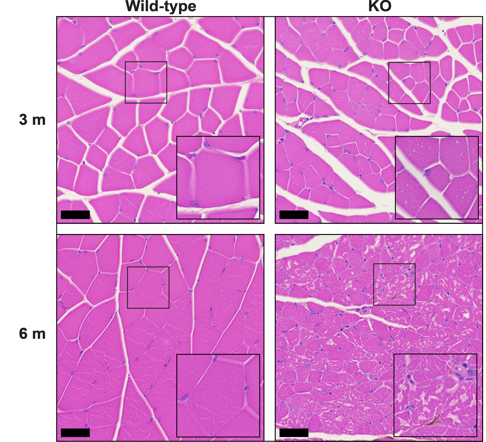

# Supplemental code for "Creatine transport and pathological changes in creatine transporter deficient mice"

[](./LICENSE)
==============================

## Introduction
This repository contains the supplemental code and image analysis pipelines for the quantification of muscle fiber pathology in SLC6A8 knockout mice.

## Histopathology
Reproduced from the Figure 1 legend of Wawro et al. 2021:<br>
"Formalin-fixed paraffin-embedded hematoxylin and eosin (H&E) stained sections of skeletal muscle (gastrocnemius) from WT and Slc6a8 -/y mice showed atrophic muscle fibers with increased fiber size variation at 3 months that at 6 months had progressed to a distinct vacuolar myopathy (magnification main 200x, inset 400x. Scale bar 50 μm at 200x)"


## Microscopy and Computational Image Analysis
Reproduced from the methods section of Wawro et al. 2021:<br>
"Brightfield imaging was performed on a Nikon Eclipse Ni-E motorized upright microscope equipped with 20×/0.75 NA and 40×/0.95 NA air objectives. Digital images were acquired with a SPOT Insight 12 MP CMOS Camera with white balance and flatfield correction. Muscle fibers were segmented in ilastik version 1.3.3 using manual labeling of a subset of wild-type and knockout histopathology images to train a pixel-level classifier using the autocontext 2-stage pipeline. A custom image analysis pipeline to quantify muscle histomorphometry was developed in Cell Profiler version 4.0.2  using the images segmented in ilastik followed by additional image processing including marker-controlled watershed to separate adjacent myofibers (source code and pipeline at https://github.com/jnirschl/slc6a8_ko). Segmented objects were  filtered by shape factors including circularity  to obtain myofibers in cross-section and exclude tangential or longitudinal fibers, which was confirmed by manual review. At least 100 myofibers were used to compute the maximum Feret diameter and cross-sectional area for each mouse. An unequal variances t-test was used to compare each WT–KO pair at 3 and 6 months (n=5 per genotype, per time point)."


------------------
## License and Citation
These scripts are released under the [MIT License](https://opensource.org/licenses/MIT).

If you use use the code or models in your research, please cite:

Wawro AM, Gajera CR, Baker SA, Nirschl JJ, Vogel H, Montine TJ. Creatine transport and pathological changes in creatine transporter deficient mice [published online ahead of print, 2021 Jan 2]. J Inherit Metab Dis. 2021;10.1002/jimd.12358. [doi:10.1002/jimd.12358](https://doi.org/10.1002/jimd.12358)

[**PMID**: 33389772](https://pubmed.ncbi.nlm.nih.gov/33389772/)
[**DOI**: 10.1002/jimd.12358](https://doi.org/10.1002/jimd.12358)

Bibtex formatted reference:
```text
@article{https://doi.org/10.1002/jimd.12358,
author = {Wawro, Adam M. and Gajera, Chandresh R. and Baker, Steven A. and Nirschl, Jeffrey J. and Vogel, Hannes and Montine, Thomas J.},
title = {Creatine transport and pathological changes in creatine transporter deficient mice},
journal = {Journal of Inherited Metabolic Disease},
volume = {n/a},
number = {n/a},
pages = {},
year = {2021},
doi = {https://doi.org/10.1002/jimd.12358},
url = {https://onlinelibrary.wiley.com/doi/abs/10.1002/jimd.12358},
eprint = {https://onlinelibrary.wiley.com/doi/pdf/10.1002/jimd.12358},
abstract = {Summary The severe impact on brain function and lack of effective therapy for patients with creatine (Cr) transporter deficiency motivated the generation of three ubiquitous Slc6a8 deficient mice (-/y). While each mouse knock-out line has similar behavioral effects at 2 to 3 months of age, other features critical to the efficient use of these mice in drug discovery are unclear or lacking: the concentration of Cr in brain and heart differ widely between mouse lines, there are limited data on histopathologic changes, and no data on Cr uptake. Here, we determined survival, measured endogenous Cr and uptake of its deuterium-labeled analogue Cr-d3 using a liquid chromatography coupled with tandem mass spectrometry assay, and performed comprehensive histopathologic examination on the Slc6a8-/y mouse developed by Skelton et. al. Our results show that Slc6a8-/y mice have widely varying organ-specific uptake of Cr-d3, significantly diminished growth with the exception of brain, progressive vacuolar myopathy, and markedly shortened lifespan. This article is protected by copyright. All rights reserved.}
}
```

--------

<p><small>Project based on the <a target="_blank" href="https://drivendata.github.io/cookiecutter-data-science/">cookiecutter data science project template</a>. #cookiecutterdatascience</small></p>
